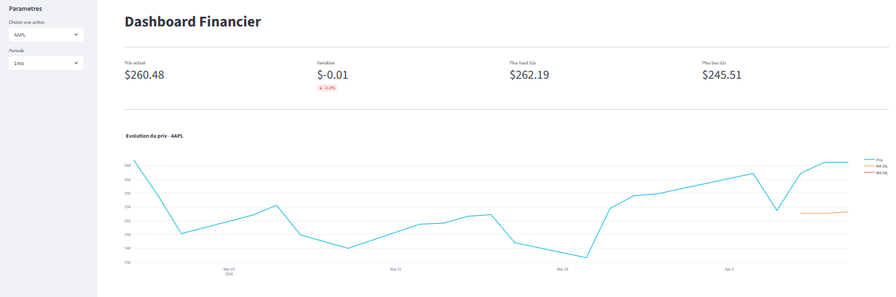

# Dashboard Financier Interactif

Dashboard interactif de visualisation de données boursières en temps réel.

## Fonctionnalités
- Prix en temps réel de AAPL, GOOGL, MSFT, AMZN
- Variation journalière, plus haut/bas sur 52 semaines
- Graphique interactif avec moyennes mobiles MA20 et MA50
- Tableau des 10 dernières séances

## Résultat

## Lancer le projet
pip install streamlit yfinance plotly pandas
streamlit run p1.py

## Technologies
Python | Streamlit | Plotly | yFinance | Pandas
